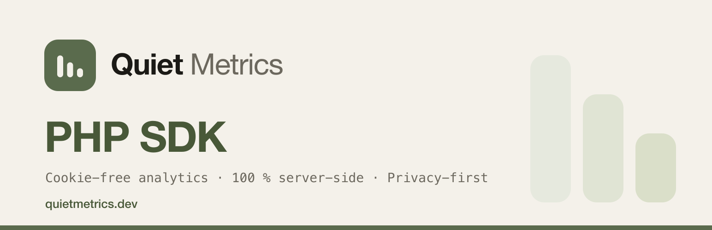

# quiet-metrics/php-metrics



> 🇫🇷 [Version française](README.fr.md)

Plain-PHP SDK for [Quiet Metrics](https://quietmetrics.dev) (La Boîte à Code): audience measurement with no identification or tracking cookies, sent 100% from your server, hence invisible to ad blockers. Zero dependencies, compatible with PHP >= 7.4 (shared hosting and WordPress included).

It is also the foundation of the framework bridges: [`quiet-metrics/laravel-metrics`](https://github.com/Quiet-Metrics/laravel-metrics) and [`quiet-metrics/symfony-metrics`](https://github.com/Quiet-Metrics/symfony-metrics) depend on this package.

## Installation

```bash
composer require quiet-metrics/php-metrics
```

## Configuration

The constructor takes the site's public key, the secret key and an options array.

> **The secret key is essential for server-side sending.** It enables signed
> mode (HMAC), the only case where the platform trusts the visitor IP and
> User-Agent carried in the payload. Without it, every hit is attributed to
> YOUR server's IP address: all your visitors would count as one. Only omit
> it behind the first-party proxy (`examples/qm-proxy.php`), which signs by
> itself.

```php
use QuietMetrics\Client;

$qm = new Client('qm_pub_demo', 'qm_sec_xxx', [
    'endpoint' => 'https://quietmetrics.dev/api/v1/collect', // default
    'timeout_ms' => 400,             // max time granted to the send (min 50)
    'async' => true,                 // fire-and-forget socket; false = short synchronous cURL
    'trust_proxy_headers' => false,  // true if the app sits behind a reverse proxy / CDN
    'defaults' => [],                // context applied to every hit, e.g. ['lang' => 'en-US']
]);
```

Both keys live in the site settings of the Quiet Metrics dashboard.

## Usage

```php
use QuietMetrics\Client;

$qm = new Client('qm_pub_demo', 'qm_sec_xxx');

// Page view: the visitor's URL, referrer, IP, User-Agent and language
// are inferred from the current HTTP request.
$qm->pageview();

// Custom event with properties (scalar values, 30 keys max).
$qm->event('purchase', ['amount' => 49, 'plan' => 'pro']);
```

Outside an HTTP request (CLI, cron, worker), pass the context as overrides; `url` is then required:

```php
$qm->event('import', ['rows' => 1200], [
    'url' => 'https://app.example/cron',
    'ip'  => $visitorIp,         // IP of the visitor concerned, if known
    'ts'  => time(),             // event timestamp
]);
```

Accepted overrides are `url`, `referrer`, `ip`, `ua`, `lang` and `ts`; they take precedence over the inferred context and also apply to `pageview()`.

### First-party anti-adblock proxy

[`examples/qm-proxy.php`](examples/qm-proxy.php): a single file to drop at the root of the client site. The browser only ever talks to the site's own domain; the proxy injects the visitor's real IP and User-Agent, signs the payload with the secret key, then forwards it to the collection server. No domain-based blocklist can catch it.

```html
<script defer src="/qm.js" data-site="qm_pub_demo" data-endpoint="/qm-proxy.php"></script>
```

The three constants to fill in (`QM_ENDPOINT`, `QM_SECRET`, `QM_MAX_BODY`) are documented in the file header.

## Opting out of measurement

A visitor can ask to stop being counted, with no account and without writing to anyone: they visit a page of your site with `?qm_ignore=1`, and `?qm_ignore=0` puts them back into measurement.

```
https://mysite.com/?qm_ignore=1     stop being counted
https://mysite.com/?qm_ignore=0     be counted again
```

The marker is a **first-party cookie of your own site**, named `qm_ignore` with the value `1` (`path=/`, `samesite=lax`, `secure` over https, five years). Reading it is automatic: while the marker is there, `pageview()` and `event()` send nothing. Writing it is one line, to be called early in the request and before any output, since storing or clearing a cookie writes an HTTP header:

```php
\QuietMetrics\Client::handleOptOutRequest();
```

The call is static, does nothing when the URL asks for nothing, and stays silent when headers have already been sent: per the package contract, it never breaks the host site.

It holds no identifier (its value is the same for everyone), it is never transmitted to Quiet Metrics, and it exists only to stop measurement: it is an opt-out marker, not a tracker. The JS tracker additionally writes the same value to `localStorage`, but a server-side SDK only ever reads the cookie: one visit therefore covers both tracking modes.

## Visit continuity

When the visitor fingerprint changes mid-visit (4G, then wifi), the same person would otherwise be counted as two unique visitors on the same day. A second **first-party cookie of your own site** closes that gap: `qm_visit`, value `1` (`path=/`, `samesite=lax`, `secure` over https), on a sliding ten-minute window pushed back by every measured hit. Each hit reports whether it was already there as the `c` key of the payload.

Reading it is automatic. Opening the window is one line, to be called for a measured hit only, early in the request and before any output; it returns whether a visit was already under way, so pass that on rather than re-reading the cookie you have just refreshed:

```php
$ongoing = \QuietMetrics\Client::handleVisitRequest();
$qm->pageview(['visit' => $ongoing]);
```

Its value is a constant, the same for everyone, so it identifies nobody: it only says that a visit is already under way in this browser. It is never written to someone who has set the opt-out marker, and never written when nothing is measured.

Note for cached sites: a measured response now carries a `Set-Cookie` header, which some reverse proxies and CDNs treat as a reason not to store the response.

## How it works

- **Compact payload**: short keys (`k`, `t`, `u`, `n`, `r`, `l`, `p`, `c`), capped at 4 KB. Full spec: `docs/05-api-et-sdk.md` at the monorepo root.
- **Signed mode**: with the secret key, every hit ships with the `X-QM-Timestamp` and `X-QM-Signature` headers (HMAC-SHA256 of `timestamp.body`). This is the only thing that authorises the collection server to honour the visitor IP, User-Agent and timestamp carried in the payload.
- **Non-blocking**: "write-and-forget" socket (about 1 ms as perceived by the page), cURL fallback with a 400 ms timeout when outgoing sockets are disabled.
- **Never throws**: every failure (unreachable endpoint, oversized payload, missing context) is silent. Analytics never breaks the host site.

Compatibility: PHP >= 7.4, `ext-json` only (`ext-curl` suggested for the fallback transport). Tests: `composer test` (PHPUnit against a real HTTP capture server, see `tests/`).

## License

MIT. A [La Boîte à Code](https://laboiteacode.fr) product for [Quiet Metrics](https://quietmetrics.dev).
